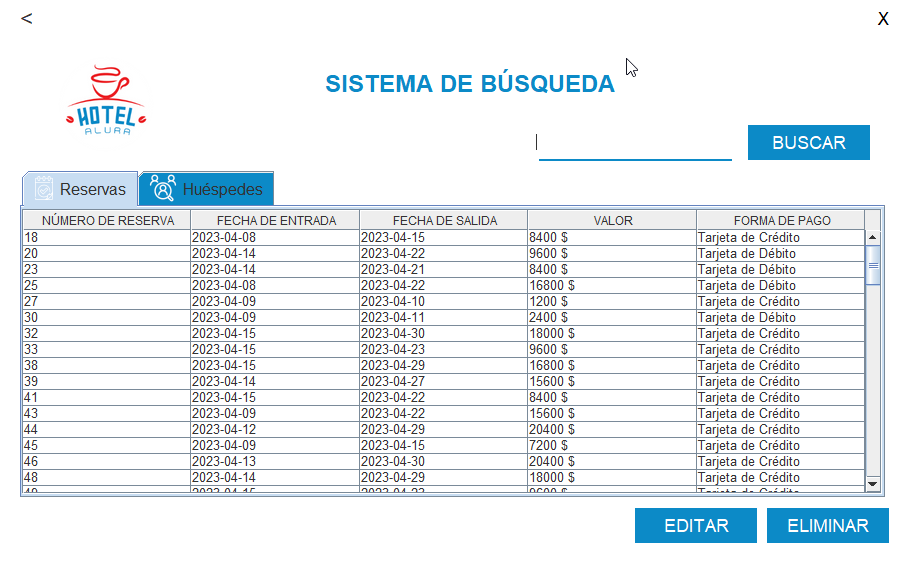

## Chagllenge 3: Hotel Administrator

### Descripción

Esta aplicación está diseñada para administrar un hotel, en el cual se pueden registrar clientesy reservas, es posible registrar una reserva y añadir uno o más clientes a la misma, también permite la edición y eliminación de reservas y clientes.

### Instalación

La aplicación es simple y solo requiere ejecutar el archivo hotel-admin.jar y tener una base de datos mysql, para la creación de la base de datos se puede utilizar el script que se encuentra en la carpeta database, el cual se llama hotel.sql, este script contiene las tablas necesarias para el funcionamiento de la aplicación.

### Uso

La autenticación es simple no hay medidas de seguridad, solo se debe ingresar el usuario y contraseña, el usuario por defecto es admin y la contraseña es admin, una vez autenticado se puede acceder a la aplicación.

La aplicación evalúa el valor de la reserva de manera automática considerando las fechas de entrada y salida, el valor por día es de 1200, para cambiar este valor es necesario editar el archivo config.properties que se encuentra en la carpeta database, en este archivo se encuentra la configuración de la base de datos y el valor por día.

- El apartado de búsqueda permite listar los clientes y reservasiones en la base de datos así como su edición y eliminación.

### Ejecutable

- Se puede descargar el ejecutable .jar para su explotación aquí [release](https://github.com/Drako9159/hotel-administrator/releases/tag/hotel-admin1.2)

Este proyecto fue realizado para el Challenge de ALURA by Oracle Abril 2023. ✔

- Twitter [@drako9159](https://twitter.com/Drako9159)
- Sitio [@Web](https://www.drako.icu)
- Linkedin [Antonio Jaramillo](https://www.linkedin.com/in/antonio-jaramillo-099a77250)